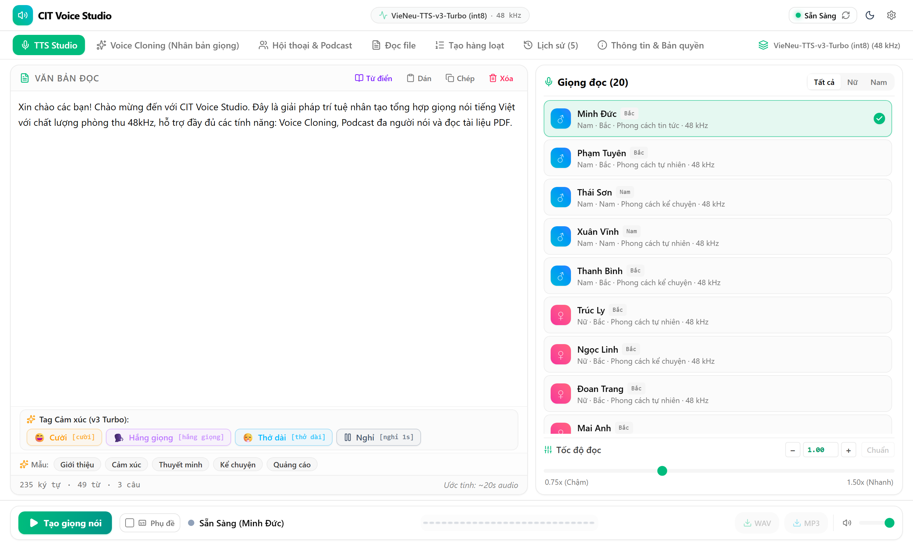

# CIT Voice Studio

Phần mềm chuyển văn bản tiếng Việt thành giọng nói, chạy hoàn toàn trên máy tính của bạn.

Không cần tài khoản. Không cần Internet sau khi cài. Văn bản và giọng nói của bạn không bị gửi đi đâu cả.

Chạy trên **Windows**, **Linux** và **macOS** (Mac chip Apple).

<p align="center">
  
</p>

---

## Tải về

**[⬇ Trang tải về (Releases)](../../releases/latest)** — chọn đúng file cho máy của bạn:

| Máy của bạn | File tải | Dung lượng |
|---|---|---|
| Windows 10/11 64-bit | `CIT-Voice-Studio-v1.0.0-win-x86_64.exe` | ~365 MB |
| Ubuntu, Debian, Linux Mint… | `cit-voice-studio_1.0.0_amd64.deb` | ~460 MB |
| Linux khác (64-bit) | `CIT-Voice-Studio-v1.0.0-linux-x86_64.tar.gz` | ~460 MB |
| Mac chip Apple (M1, M2, M3…), macOS 14 trở lên | `CIT-Voice-Studio-v1.0.0-macos-arm64.dmg` | ~410 MB |

Mọi bản đều kèm sẵn mô hình giọng nói: cài xong dùng được ngay, không cần Internet, dữ liệu lưu trực tiếp trên máy bạn.

### Windows

1. Tải file `CIT-Voice-Studio-v1.0.0-win-x86_64.exe`.
2. Bấm đúp và làm theo hướng dẫn. Bộ cài không đòi quyền quản trị (Administrator).
3. Mở ứng dụng từ biểu tượng ngoài Desktop hoặc trong Start Menu.

**Gỡ cài đặt:** Settings → Apps → CIT Voice Studio → Uninstall.

### Linux

**Bản .deb** (Ubuntu, Debian, Linux Mint…):

```bash
sudo apt install ./cit-voice-studio_1.0.0_amd64.deb
```

Mở bằng mục **CIT Voice Studio** trong menu ứng dụng, hoặc gõ `cit-voice-studio` trong Terminal. Gỡ: `sudo apt remove cit-voice-studio`.

**Bản .tar.gz** (mọi bản Linux, không cần sudo): giải nén, rồi trong thư mục vừa giải nén chạy `./CIT-Voice-Studio`.

Trên Linux, ứng dụng chạy trong một cửa sổ Terminal và mở giao diện bằng trình duyệt tại `http://127.0.0.1:8001`. Giữ Terminal mở trong lúc dùng; đóng Terminal hoặc bấm `Ctrl+C` để tắt.

### macOS (Mac chip Apple)

1. Mở file `.dmg`, kéo **CIT Voice Studio** vào thư mục **Applications**.
2. Lần đầu mở, macOS chặn vì ứng dụng chưa được Apple chứng thực: vào **System Settings → Privacy & Security**, kéo xuống cuối, bấm **Open Anyway**.
3. Ứng dụng có cửa sổ riêng; tắt bằng `Cmd+Q`.

Chưa có bản cho Mac chip Intel.

Bản Linux và macOS có file `HUONG-DAN.txt` đi kèm, hướng dẫn chi tiết.

---

## Tính năng

### Tạo giọng nói
- **20 giọng có sẵn**: nam và nữ, giọng Bắc, Trung, Nam, nhiều phong cách (tin tức, kể chuyện, đọc truyện, tự nhiên…). Danh sách chọn giọng ghi rõ giới tính, vùng miền và phong cách.
- **Nghe thử từng giọng** ngay trong danh sách trước khi chọn.
- **Đọc tiếng Anh xen tiếng Việt**: tự nhận ra từ tiếng Anh và đọc đúng.
- Chỉnh tốc độ đọc từ 0.75x đến 1.50x.
- Xuất **WAV** (48 kHz) hoặc **MP3**.

### Điều khiển cách đọc
- **Thẻ cảm xúc** chèn ngay trong câu: `[cười]`, `[thở dài]`, `[hắng giọng]`.
- **Thẻ nghỉ** tạo khoảng lặng dài đúng như ý: `[nghỉ 2s]`, `[nghỉ 500ms]` (tối đa 10 giây mỗi thẻ).
- **Từ điển phát âm**: tự đặt cách đọc cho từ viết tắt hay tên riêng mà máy đọc sai, ví dụ `KTX` → "ký túc xá", `SGK` → "sách giáo khoa". Mở bằng nút **Từ điển** trên khung soạn thảo; từ điển được lưu lại và dùng cho mọi lần tạo giọng.

### Nhân bản giọng nói
- Tạo giọng mới từ một đoạn ghi âm mẫu dài 3–8 giây.
- Lưu giọng đã nhân bản để dùng lại, và xoá khi không cần nữa.

### Hội thoại / Podcast
- Viết kịch bản nhiều nhân vật, mỗi nhân vật một giọng; ứng dụng ghép thành một file audio.

### Đọc file
- Lấy văn bản từ **PDF, Word (.docx) và TXT**.
- Nút **Làm sạch** bỏ khoảng trắng thừa, gạch đầu dòng và chỗ xuống dòng giữa câu, nhưng giữ nguyên công thức như `1 + 1`.

### Tạo hàng loạt
- Đặt mốc `[P1]`, `[P2]`… ở đầu dòng: mỗi mốc thành **một file audio riêng**.
- Nhập trực tiếp hoặc tải lên file TXT. Có sẵn file mẫu để tải về.
- Tải từng file, hoặc tải tất cả trong một file **.zip**.

### Phụ đề cho video
- Tạo audio kèm **phụ đề .srt**, mốc thời gian khớp theo từng câu. Dùng thẳng trong CapCut, Premiere, DaVinci Resolve…

### Lịch sử
- Các bản đã tạo được lưu trên máy và **còn nguyên sau khi tắt ứng dụng**: nghe lại, tải lại WAV/MP3/SRT, mở thư mục chứa file.
- Tự dọn bản cũ nhất khi vượt 300 bản hoặc 1 GB.

---

## Cú pháp nhanh

| Viết trong văn bản | Kết quả |
|---|---|
| `Tin vui [cười] cho cả nhà.` | Cười ngay tại chỗ đó |
| `Phần một. [nghỉ 2s] Phần hai.` | Im lặng đúng 2 giây giữa hai phần |
| `[P1]` … `[P2]` … | Tab **Tạo hàng loạt**: tách thành nhiều file |

---

## Chọn mô hình theo máy

Đổi mô hình trong **Cài đặt → Quản lý & Chọn Mô hình AI**. Mô hình nào máy không chạy được sẽ bị làm mờ, di chuột vào để xem lý do.

| Máy của bạn | Nên dùng | Ghi chú |
|---|---|---|
| Máy thường, laptop văn phòng, **máy yếu** | **v3 Turbo INT8** (mặc định) | Có sẵn trong bộ cài. Nhanh nhất khi chạy bằng CPU, âm thanh 48 kHz |
| Máy có **card NVIDIA** (Windows, Linux) | **v3 Turbo GPU NVIDIA** | Bấm **Cài hỗ trợ GPU** ngay tại mô hình đó |
| Muốn thử mô hình nhỏ | v3 Nano (thử nghiệm) | Tải thêm ~400 MB, âm thanh 24 kHz, đọc tiếng Anh kém hơn |

**Máy yếu có chạy được không?** Được. Ứng dụng chạy bằng CPU, không cần card đồ hoạ. Đo trên laptop Intel Core i7-8650U (2017, 4 nhân) với mô hình mặc định: đoạn đọc dài 1 phút mất khoảng 30 giây để tạo. Máy mới hơn sẽ nhanh hơn.

Máy yếu cứ giữ **Turbo INT8**. Nano nhỏ hơn nhưng **không nhanh hơn**: trên cùng laptop đó, Nano ở cài đặt mặc định chậm gần gấp đôi Turbo INT8.

**Máy có card NVIDIA:** không có bộ cài riêng cho GPU, vẫn dùng bộ cài như trên. Trong ứng dụng, vào **Cài đặt → Quản lý & Chọn Mô hình AI**, bấm **Cài hỗ trợ GPU** ở mô hình GPU NVIDIA. Ứng dụng tự tải PyTorch/CUDA (vài GB, cần ít nhất 12 GB trống, chỉ tải một lần). Máy cần cài sẵn driver NVIDIA (kiểm tra bằng lệnh `nvidia-smi`). Lợi rõ nhất là khi tạo một đoạn dài sẽ thấy sự khác biệt. macOS chỉ chạy CPU.

---

## Kết nối từ phần mềm khác (API)

Khi ứng dụng đang mở, nó chạy sẵn một máy chủ API ở `http://127.0.0.1:8001`. Phần mềm khác, script hay AI Agent gọi vào đó để tạo giọng nói tự động.

| Method | Đường dẫn | Việc |
|---|---|---|
| `GET` | `/health` | Trạng thái máy chủ |
| `GET` | `/voices` | Danh sách giọng đọc |
| `GET` `POST` | `/stream` | Đọc theo thời gian thực |
| `POST` | `/api/tts/generate` | Văn bản thành WAV/MP3 |
| `POST` | `/api/tts/generate-with-subtitles` | Audio kèm phụ đề .srt |
| `POST` | `/api/tts/clone` | Nhân bản giọng từ mẫu |
| `POST` | `/api/tts/conversation` | Hội thoại nhiều người nói |

Thẻ cảm xúc, thẻ nghỉ và từ điển phát âm đều dùng được qua API.

Ví dụ nhanh (Python):

```python
import requests

r = requests.post(
    "http://127.0.0.1:8001/api/tts/generate",
    json={"text": "Xin chào từ phần mềm khác.", "voice_id": "Minh Đức"},
)
open("giong-noi.wav", "wb").write(r.content)
```

**Tài liệu đầy đủ:**
- `http://127.0.0.1:8001/docs`: bấm thử từng API ngay trong trình duyệt.
- `http://127.0.0.1:8001/cit-voice-studio.md`: hướng dẫn tích hợp dạng Markdown, nạp thẳng cho Cursor, Claude, ChatGPT…
- `http://127.0.0.1:8001/openapi.json`: nhập vào Postman.
- [docs/postman/CIT-Voice-Studio.postman_collection.json](docs/postman/CIT-Voice-Studio.postman_collection.json): bộ request Postman dựng sẵn, sửa biến `baseUrl` và `apiKey` là dùng.

### Gọi từ máy khác trong mạng LAN

Mặc định chỉ phần mềm **trên cùng máy** gọi được API, và không cần khoá.

Muốn máy khác gọi vào:
1. Mở **Cài đặt → Cho máy khác truy cập API**, tích bật.
2. Bấm **Khởi động lại ngay**. Lần đầu, Windows hỏi quyền tường lửa: chọn **Cho phép** với mạng **Riêng tư**. Trên Linux có bật tường lửa thì chạy `sudo ufw allow 8001/tcp`.
3. Lấy địa chỉ (dạng `http://192.168.x.x:8001`) và **khoá API** hiện ngay trong Cài đặt.
4. Máy khác gửi khoá qua header `X-API-Key`:

```bash
curl.exe -H "X-API-Key: <khoá>" http://192.168.1.5:8001/health
```

Máy khác chỉ gọi được các API tạo giọng ở bảng trên; không xem được lịch sử hay cài đặt. Bấm **Khoá mới** để thu hồi khoá cũ ngay lập tức.

> ⚠️ Chỉ bật trong mạng tin cậy. Khoá đi qua HTTP không mã hoá. Muốn đưa ra Internet, hãy dùng đường hầm HTTPS (Cloudflare Tunnel, ngrok) thay vì mở cổng trên router.

---

## Dữ liệu được lưu ở đâu

Mọi thứ nằm trên máy bạn:

| Hệ điều hành | Thư mục |
|---|---|
| Windows | `%LOCALAPPDATA%\CitVoiceStudio\` |
| Linux | `~/CitVoiceStudio/` |
| macOS | `~/Library/Application Support/CIT Voice Studio/` |

Trong đó:

| Thư mục / file | Nội dung |
|---|---|
| `history\` | Lịch sử audio và phụ đề đã tạo |
| `pronunciation-dict.json` | Từ điển phát âm |
| `remote-access.json` | Cài đặt truy cập từ máy khác và khoá API |
| `server-settings.json` | Cổng máy chủ |

Trên Windows và bản Linux `.tar.gz`, mô hình và giọng nhân bản nằm trong thư mục `models` cạnh ứng dụng. Bản Linux `.deb` và macOS để chúng trong thư mục dữ liệu ở bảng trên. Cập nhật lên bản mới không làm mất dữ liệu.

---

## Lỗi thường gặp

**Windows chặn không cho mở**
Bộ cài chưa được ký số (code signing), nên Windows có thể cảnh báo. Tuỳ thông báo:

- *"Windows protected your PC"* (màn hình xanh SmartScreen): bấm **More info** → **Run anyway**.
- File bị đánh dấu tải từ Internet: chuột phải vào file `.exe` → Properties → tích **Unblock** → OK.
- *"Smart App Control blocked an app that may be unsafe"* (Windows 11): Smart App Control chặn mọi ứng dụng chưa ký số và **không cho mở riêng từng ứng dụng**, nên Unblock hay Run anyway đều không có tác dụng. Cách duy nhất là tắt tính năng này: **Windows Security → App & browser control → Smart App Control settings → Off**.
  > ⚠️ Tắt Smart App Control làm giảm một lớp bảo vệ của Windows, và trên nhiều bản Windows **không bật lại được** nếu không cài lại Windows. Chỉ tắt khi bạn tin nguồn tải về (trang Release chính thức của repo này). Không muốn tắt thì hãy cài trên máy khác.

**macOS: "không thể mở vì không xác minh được nhà phát triển"**
Vào **System Settings → Privacy & Security**, bấm **Open Anyway**. Hoặc chạy trong Terminal:

```bash
xattr -dr com.apple.quarantine "/Applications/CIT Voice Studio.app"
```

**macOS: ứng dụng không mở trên máy cũ**
Cần macOS 14 Sonoma trở lên.

**Linux: giao diện không tự mở**
Mở trình duyệt và vào `http://127.0.0.1:8001`. Giữ cửa sổ Terminal của ứng dụng đang mở.

**Windows: ứng dụng mở bằng trình duyệt thay vì cửa sổ riêng**
Không phải lỗi, mọi tính năng vẫn dùng được. Máy thiếu **Microsoft Edge WebView2 Runtime** nên ứng dụng tự chuyển sang trình duyệt. Muốn có cửa sổ riêng thì cài WebView2 Runtime (miễn phí, của Microsoft):
<https://go.microsoft.com/fwlink/p/?LinkId=2124703>

Windows 11 có sẵn. Windows 10 thường có nếu đã cài Edge bản mới; bản LTSC hoặc máy mới cài lại hay thiếu.

**Chọn mô hình FP32 thì báo lỗi**
Bộ cài chỉ kèm mô hình INT8. FP32 phải tải thêm khoảng 453 MB, nên lần chọn đầu tiên cần Internet.

**Mục chọn mô hình bị làm mờ**
Máy không chạy được mô hình đó. Di chuột vào để xem lý do.

**Báo lỗi cổng 8001 đang bị chiếm**
Đóng hẳn ứng dụng rồi mở lại. Vẫn lỗi thì đổi cổng trong **Cài đặt → Cổng server**, hoặc khởi động lại máy.

**Máy khác không gọi được API**
- Kết nối bị từ chối: kiểm tra đã bật **Cho máy khác truy cập API**, đã khởi động lại ứng dụng, và tường lửa Windows cho phép ứng dụng.
- `401`: thiếu hoặc sai khoá.
- `403`: tính năng đang tắt.
- `404`: đường dẫn không nằm trong danh sách API công khai.

**Máy đọc sai một từ viết tắt**
Thêm từ đó vào **Từ điển** với cách đọc mong muốn, ví dụ `KTX` → `ký túc xá`.

---

## Dự án tạo video có thể dùng kèm

- Tạo video so sánh 2 khái niệm: 🔗 [github.com/Cuongyd196/auto-compare-video](https://github.com/Cuongyd196/auto-compare-video)
- Tạo video từ một đường link / bài viết: 🔗 [github.com/Cuongyd196/auto-video-gen](https://github.com/Cuongyd196/auto-video-gen)
- Tạo video từ một chủ đề bằng Remotion: 🔗 [github.com/Cuongyd196/remotion-cuongit-template](https://github.com/Cuongyd196/remotion-cuongit-template)
- Các video mẫu mình đã làm, xem trong Reels hoặc TikTok:
  - 📹 Facebook: [www.facebook.com/cuongit96/reels/](https://www.facebook.com/cuongit96/reels/)
  - 📹 TikTok: [www.tiktok.com/@cuongit96](https://www.tiktok.com/@cuongit96)

Nếu thấy hữu ích, cho mình 1 star GitHub nhé 🌟

Muốn ủng hộ mình 1 ly cà phê: [buymeacoffee.com/cuongit96/gallery/4959449](https://buymeacoffee.com/cuongit96/gallery/4959449)

---

## Nguồn gốc

CIT Voice Studio do **Cường IT** phát triển, dựa trên **VieNeu-TTS** của tác giả **Phạm Nguyễn Ngọc Bảo**.

Mô hình giọng nói là của VieNeu-TTS. Phần Cường IT làm là ứng dụng: giao diện, các tính năng ở trên và bộ cài cho Windows, Linux và macOS.

| | |
|---|---|
| Mô hình gốc | [pnnbao97/VieNeu-TTS](https://github.com/pnnbao97/VieNeu-TTS) |
| Mô hình trên Hugging Face | [pnnbao-ump/VieNeu-TTS](https://huggingface.co/pnnbao-ump/VieNeu-TTS) |
| Tác giả bản này | [me.cuongit.net](https://me.cuongit.net) |

---

## Giấy phép

Apache License 2.0. Xem [LICENSE](LICENSE) và [NOTICE](NOTICE).
