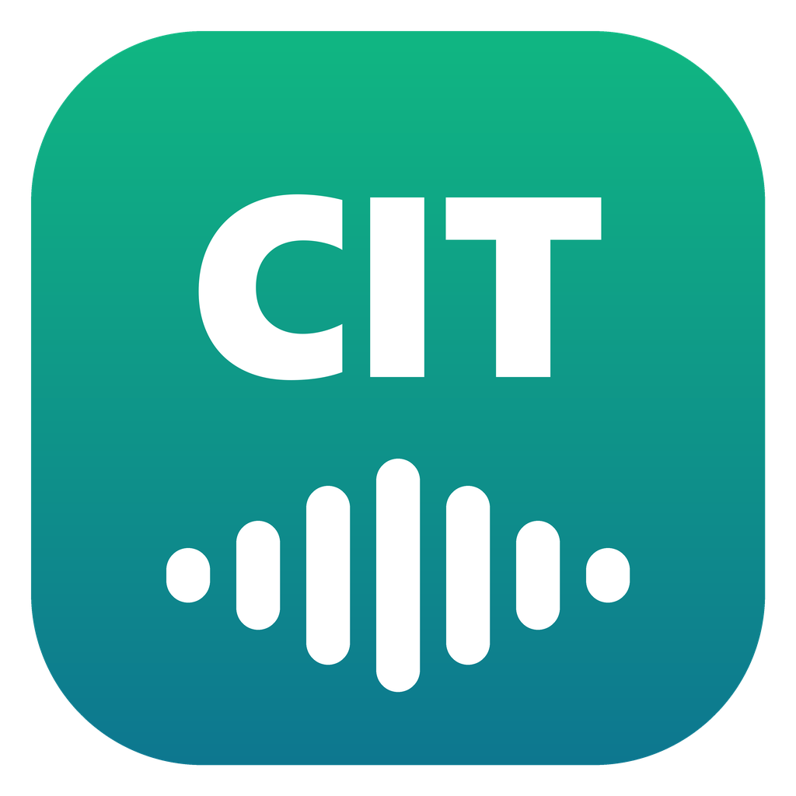
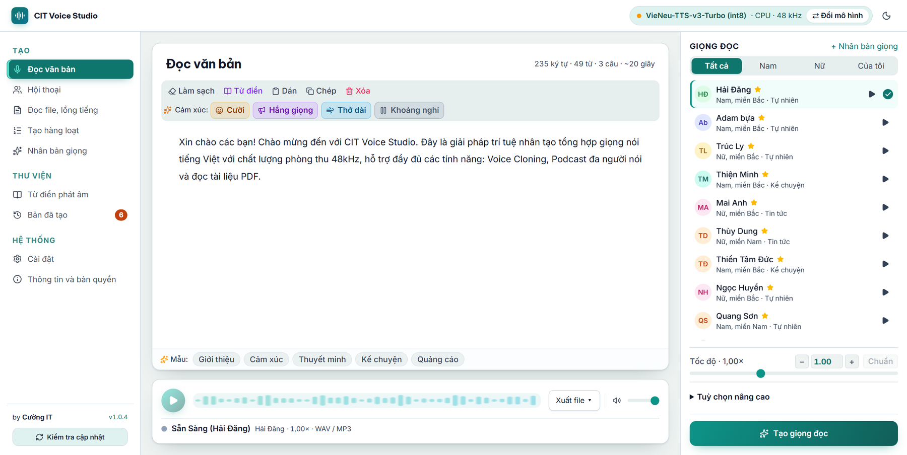

<div align="center">



# CIT Voice Studio

**Chuyển văn bản tiếng Việt thành giọng nói tự nhiên, ngay trên máy tính của bạn.**

Không cần tài khoản · Không cần Internet sau khi cài · Văn bản và giọng nói không rời khỏi máy

[](../../releases/latest)
[](../../releases)


**[⬇ Tải về](#tải-về)** &nbsp;·&nbsp; **[Tính năng](#tính-năng)** &nbsp;·&nbsp; **[API](#kết-nối-từ-phần-mềm-khác-api)** &nbsp;·&nbsp; **[Lỗi thường gặp](#lỗi-thường-gặp)**

<br>

<picture>
  <source media="(prefers-color-scheme: dark)" srcset="assets/giao-dien-toi.png">
  
</picture>

</div>

<br>

| 🎙️ **25 giọng tiếng Việt** | 🧬 **Nhân bản giọng** | 🌍 **31 ngôn ngữ** |
|---|---|---|
| Nam, nữ, ba miền Bắc - Trung - Nam; tin tức, kể chuyện, đọc truyện… Âm thanh 48 kHz. | Thu micro 3–8 giây hoặc nhập file MP3/WAV/M4A để tạo giọng của riêng bạn. | Tải thêm Supertonic 3 để đọc tiếng Anh, Nhật, Hàn, Pháp, Đức… với 10 giọng. |
| 🎧 **Podcast, hội thoại** | 🎬 **Lồng tiếng theo phụ đề** | 🔌 **API cho phần mềm khác** |
| Mỗi nhân vật một giọng, ghép thành một file audio. | Thả file `.srt`, giọng đọc khớp đúng mốc thời gian của video. | Gọi từ script, phần mềm khác hay AI Agent qua `http://127.0.0.1:8001`. |

### Có gì mới ở 1.0.4

- **Giao diện mới**: bố cục studio rõ ràng, tương phản cao, có chế độ tối.
- **Từ điển phát âm** nhập/xuất bằng file CSV (mở bằng Excel), có file mẫu.
- **Nhân bản giọng** nhận thêm file WAV và M4A; chỉ cần đọc kỹ điều khoản và xác nhận quyền sử dụng giọng.
- ⚠️ Điều khoản sử dụng lên bản **1.2**: lần đầu mở bản mới, bạn sẽ được hỏi đồng ý lại.

Chi tiết từng phiên bản: [trang Releases](../../releases).

---

## Tải về

**[⬇ Trang tải về (Releases)](../../releases/latest)** hoặc **[⬇ Google Drive](https://drive.google.com/drive/folders/1vzFJcLetAI16NjlX6-kxjrHzzd4Fq2Q-?usp=sharing)** (khi GitHub tải chậm) - chọn đúng file cho máy của bạn:

| Máy của bạn | File tải | Dung lượng |
|---|---|---|
| Windows 10/11 64-bit | `CIT-Voice-Studio-v1.0.4-win-x86_64.exe` | ~380 MB |
| Linux 64-bit: Ubuntu, Debian, Linux Mint… | `CIT-Voice-Studio-v1.0.4-amd64.deb` | ~463 MB |
| Mac chip Apple (M1, M2, M3…, arm64), macOS 14 trở lên | `CIT-Voice-Studio-v1.0.4-macos-arm64.dmg` | ~427 MB |
| Mac chip Intel (x86_64), macOS 13 trở lên | `CIT-Voice-Studio-v1.0.4-macos-x86_64.dmg` | ~447 MB |

Mọi bản đều kèm sẵn mô hình giọng nói: cài xong dùng được ngay, không cần Internet, dữ liệu lưu trực tiếp trên máy bạn.

### Cấu hình máy

| | Tối thiểu | Khuyến nghị |
|---|---|---|
| Hệ điều hành | Windows 10/11 64-bit, Ubuntu/Debian 64-bit, macOS 14 (chip Apple) hoặc macOS 13 (chip Intel) | như bên trái |
| CPU | 4 nhân | 6 nhân trở lên |
| RAM | 8 GB | 16 GB trở lên |
| Ổ đĩa trống | 3 GB | 5 GB |
| Card đồ hoạ | Không cần | Card NVIDIA nếu hay tạo bài dài (xem [Chọn mô hình theo máy](#chọn-mô-hình-theo-máy)) |

Tốc độ thử nghiệm: máy Intel Core i7 thế hệ 8 (4 nhân) - 10 phút audio mất khoảng 5 phút.

**Mỗi lần tạo nên bao nhiêu ký tự?**

- **Bản 1.0.1 trở lên (Windows, Linux, macOS):** không giới hạn. Ứng dụng ghi audio dần ra ổ đĩa nên bài dài không tốn thêm RAM - đã thử văn bản ~84.000 ký tự (~2 giờ audio), ứng dụng chỉ dùng khoảng 1 GB RAM. Chỉ cần đủ thời gian và ổ đĩa trống: mỗi giờ audio WAV khoảng 330 MB. Bài vài giờ nên chia theo chương, tạo từng chương hoặc sử dụng tab **Tạo hàng loạt**, để lỡ gián đoạn không phải làm lại từ đầu, và dễ sửa từng phần.
- **Bản 1.0.0:** văn bản quá dài có thể làm ứng dụng báo lỗi bộ nhớ hoặc trắng màn hình. Tuỳ cấu hình máy, có thể tham khảo:

| RAM | Mỗi lần tạo, khoảng | Tương đương audio |
|---|---|---|
| 8 GB | 15.000 ký tự | ~20 phút |
| 16 GB | 40.000 ký tự | ~1 giờ |
| 32 GB trở lên | 60.000 ký tự | ~1 giờ 30 phút |

Đây là mức ước tính an toàn, nên thấp hơn nữa nếu đang mở nhiều ứng dụng khác. Bài dài hơn thì chia thành nhiều phần, hoặc dùng tab **Tạo hàng loạt** để mỗi phần thành một file riêng. 

### Windows

1. Tải file `CIT-Voice-Studio-v1.0.4-win-x86_64.exe`.
2. Bấm đúp và làm theo hướng dẫn. Bộ cài không đòi quyền quản trị (Administrator).
3. Mở ứng dụng từ biểu tượng ngoài Desktop hoặc trong Start Menu.

**Gỡ cài đặt:** Settings → Apps → CIT Voice Studio → Uninstall.

### Linux

Cài file `.deb` (Ubuntu, Debian, Linux Mint và các bản dựa trên Debian):

```bash
sudo apt install ./CIT-Voice-Studio-v1.0.4-amd64.deb
```

Mở bằng mục **CIT Voice Studio** trong menu ứng dụng, hoặc gõ `cit-voice-studio` trong Terminal. Gỡ: `sudo apt remove cit-voice-studio`.

Trên Linux, ứng dụng chạy trong một cửa sổ Terminal và mở giao diện bằng trình duyệt tại `http://127.0.0.1:8001`. Giữ Terminal mở trong lúc dùng; đóng Terminal hoặc bấm `Ctrl+C` để tắt.

### macOS

1. Mở file `.dmg`, kéo **CIT Voice Studio** vào thư mục **Applications**.
2. Lần đầu mở, macOS chặn vì ứng dụng chưa được Apple chứng thực: vào **System Settings → Privacy & Security**, kéo xuống cuối, bấm **Open Anyway**.
3. Ứng dụng có cửa sổ riêng; tắt bằng `Cmd+Q`.

Chọn đúng file theo chip của máy: menu  → **About This Mac**, dòng **Chip** ghi "Apple M…" thì tải bản `arm64`, dòng **Processor** ghi "Intel" thì tải bản `x86_64`.

Bản Linux và macOS có file `HUONG-DAN.txt` đi kèm, hướng dẫn chi tiết.

---

## Tính năng

### Tạo giọng nói
- **25 giọng có sẵn**: nam và nữ, giọng Bắc, Trung, Nam, nhiều phong cách (tin tức, kể chuyện, đọc truyện, tự nhiên…). Danh sách chọn giọng ghi rõ giới tính, vùng miền và phong cách.
- **Nghe thử từng giọng** ngay trong danh sách trước khi chọn.
- **Đọc tiếng Anh xen tiếng Việt**: tự nhận ra từ tiếng Anh và đọc đúng.
- Chỉnh tốc độ đọc từ 0.75x đến 1.50x.
- Xuất **WAV** hoặc **MP3**; tần số theo mô hình: Turbo 48 kHz, Nano 24 kHz, Supertonic 44,1 kHz.

### Điều khiển cách đọc
- **Thẻ cảm xúc** chèn ngay trong câu: `[cười]`, `[thở dài]`, `[hắng giọng]`.
- **Thẻ nghỉ** tạo khoảng lặng dài đúng như ý: `[nghỉ 2s]`, `[nghỉ 500ms]` (tối đa 10 giây mỗi thẻ).
- **Từ điển phát âm**: tự đặt cách đọc cho từ viết tắt hay tên riêng mà máy đọc sai, ví dụ `KTX` → "ký túc xá", `SGK` → "sách giáo khoa". Mở bằng nút **Từ điển** trên khung soạn thảo; từ điển được lưu lại và dùng cho mọi lần tạo giọng.
- Từ 1.0.4: **nhập/xuất từ điển bằng file CSV** (mở được bằng Excel, có file mẫu để tải về) và chia trang khi từ điển dài.

### Giọng nước ngoài (mới ở 1.0.3)
- Tải thêm mô hình **Supertonic 3** (~400 MB) trong **Cài đặt → Mô hình** để đọc **31 ngôn ngữ**: Anh, Nhật, Hàn, Pháp, Đức, Tây Ban Nha, Nga, Ả Rập… (chưa có tiếng Trung) với 10 giọng nam nữ.
- Chọn tiếng của đoạn văn ở ô **Ngôn ngữ văn bản** (mặc định **Tiếng Anh**, hoặc **Tự nhận theo văn bản**). Nút nghe thử giọng cũng đọc câu mẫu bằng tiếng đó. Dùng được ở mọi tab: TTS Studio, hội thoại, tạo hàng loạt, lồng tiếng theo phụ đề.
- Chạy bằng CPU, không cần cài gì thêm, có trên cả Windows, Linux và macOS. Tiếng Việt vẫn nên dùng VieNeu (chất lượng tốt hơn); mô hình này không nhân bản giọng.
- **10 giọng dùng chung cho cả 31 ngôn ngữ** (5 nữ F1–F5, 5 nam M1–M5). Chất giọng theo mô tả của Supertone:

| Giọng | Chất giọng | Hợp với |
|---|---|---|
| F1 (nữ) | Điềm tĩnh, hơi trầm | Chăm sóc khách hàng, thiền |
| F2 (nữ) | Tươi sáng, tinh nghịch | Mạng xã hội, nội dung giới trẻ |
| F3 (nữ) | Rõ ràng, kiểu phát thanh viên | Tin tức, thông báo |
| F4 (nữ) | Dứt khoát, tự tin | Giới thiệu doanh nghiệp, đào tạo |
| F5 (nữ) | Dịu dàng, êm | Sách nói, lời động viên |
| M1 (nam) | Năng động, trong | Quảng cáo, thông báo |
| M2 (nam) | Trầm, điềm đạm | Doanh nghiệp, phim tài liệu |
| M3 (nam) | Chỉn chu, đáng tin | Thuyết trình, phát biểu |
| M4 (nam) | Nhẹ nhàng, thân thiện | Giáo dục, thiếu nhi |
| M5 (nam) | Ấm, êm dịu | Sách nói, kể chuyện |

- **31 ngôn ngữ:** Anh, Việt, Nhật, Hàn, Pháp, Đức, Tây Ban Nha, Bồ Đào Nha, Ý, Nga, Indonesia, Hindi, Ả Rập, Thổ Nhĩ Kỳ, Hà Lan, Ba Lan, Ukraina, Thuỵ Điển, Đan Mạch, Phần Lan, Hy Lạp, Séc, Slovakia, Hungary, Romania, Bulgaria, Croatia, Slovenia, Estonia, Latvia, Litva.
- **Chất lượng:** mô hình khoảng 99 triệu tham số, âm thanh 44,1 kHz. Theo Supertone, độ chính xác khi đọc (WER/CER) ngang các mô hình mở lớn hơn nhiều lần, và ít lỗi lặp/bỏ chữ hơn Supertonic 2. Đo trên laptop Core i7-8650U: tiếng Anh tạo nhanh hơn thời gian đọc; tiếng Việt không nhanh hơn VieNeu và đọc chậm hơn khoảng 2 lần, nên tiếng Việt vẫn nên dùng VieNeu. Supertone đã ngừng phát triển mô hình này (kho mã được lưu trữ), nên sẽ không có bản cập nhật.
- **Thẻ cảm xúc** riêng của mô hình: `<laugh>` (cười), `<breath>` (lấy hơi), `<sigh>` (thở dài), chèn bằng thanh cảm xúc. Thẻ nghỉ `[nghỉ 2s]` dùng như bình thường.
- **Từ điển phát âm** dùng được như với VieNeu, tiện để sửa tên riêng, viết tắt mà mô hình đọc sai, ví dụ `CIT` → `C I T`, `Nguyễn` → `Nwin`, `km` → `kilometers`. Từ điển dùng chung cho mọi mô hình.

### Nhân bản giọng nói
- Chọn **Thu micro** (đọc nội dung bất kỳ bằng giọng tự nhiên khoảng 3–8 giây) hoặc **Nhập file âm thanh** (MP3, WAV hoặc M4A; WAV và M4A có từ 1.0.4) có giọng nói rõ, một người nói, không nhạc nền. Không cần đọc câu cam kết. Ứng dụng giữ tối đa 15 giây từ tiếng nói đầu tiên; Turbo dùng tối đa 8 giây có tiếng.
- Chỉ dùng giọng của bạn hoặc giọng đã được chủ giọng cho phép nhân bản và sử dụng. Phải xác nhận quyền sử dụng trước khi lưu; đây là cam kết, không phải xác minh danh tính.
- Giọng và cam kết lưu trên máy, xoá cùng nhau; không gửi về tác giả, không tự sao chép file âm thanh gốc. Cả micro và file âm thanh không cần bộ nhận dạng câu đồng ý.
- Lưu giọng đã nhân bản để dùng lại, và xoá khi không cần nữa.

### Hội thoại / Podcast
- Viết kịch bản nhiều nhân vật, mỗi nhân vật một giọng; ứng dụng ghép thành một file audio.

### Đọc file
- Lấy văn bản từ **PDF, Word (.docx) và TXT**.
- Thả file phụ đề **.srt** vào để lồng tiếng theo mốc thời gian (xem mục dưới).
- Nút **Làm sạch** bỏ khoảng trắng thừa, gạch đầu dòng và chỗ xuống dòng giữa câu, nhưng giữ nguyên công thức như `1 + 1`.

### Tạo hàng loạt
- Đặt mốc `[P1]`, `[P2]`… ở đầu dòng: mỗi mốc thành **một file audio riêng**.
- Nhập trực tiếp hoặc tải lên file TXT. Có sẵn file mẫu để tải về.
- Tải từng file, hoặc tải tất cả trong một file **.zip**.

### Phụ đề cho video
- Tạo audio kèm **phụ đề .srt**, mốc thời gian khớp theo từng câu. Dùng thẳng trong CapCut, Premiere, DaVinci Resolve…

### Lồng tiếng theo phụ đề (mới ở 1.0.2)
Đã có sẵn file phụ đề của video (tự gõ, xuất từ CapCut/Premiere, hoặc dịch từ phụ đề tiếng nước ngoài)? Ứng dụng đọc từng câu **đúng mốc thời gian** và ra một file audio để ghép thẳng vào video.

1. Mở tab **Đọc file**, thả file `.srt` (hoặc `.vtt`) vào. Ứng dụng hiện danh sách câu kèm mốc thời gian.
2. Chọn giọng (giọng có sẵn hoặc giọng bạn đã nhân bản) và tốc độ đọc, bấm **Lồng tiếng**.
3. Xong: nghe thử, tải **WAV/MP3**. File audio dài đúng bằng video, câu nào nằm đúng mốc câu đó. Bản lồng tiếng được lưu vào **Bản đã tạo**.

- Câu dài hơn khoảng thời gian của nó được **đọc nhanh hơn cho vừa** (tối đa 1,5 lần). Vẫn chưa vừa thì lấn sang khoảng lặng phía sau, hoặc đẩy câu sau lùi lại một chút. **Không bao giờ cắt chữ.**
- Khi có câu bị lùi, ứng dụng kèm **file phụ đề đã chỉnh mốc** để chữ trên video khớp với giọng đọc.
- Tự bỏ thẻ định dạng trong phụ đề (`<i>`, `{\an8}`…) và áp dụng từ điển phát âm.
- Mẹo: câu bị đọc nhanh hoặc bị lùi nhiều thì giảm tốc độ đọc, hoặc rút gọn câu trong file phụ đề.

### Bản đã tạo
- Các bản đã tạo được lưu trên máy và **còn nguyên sau khi tắt ứng dụng**: nghe lại, tải lại WAV/MP3/SRT, mở thư mục chứa file.
- Không tự xoá bản nào. Tab Bản đã tạo hiện số bản, dung lượng và nhắc dọn bớt khi chiếm nhiều ổ đĩa.

---

## Cú pháp nhanh

| Viết trong văn bản | Kết quả |
|---|---|
| `Tin vui [cười] cho cả nhà.` | Cười ngay tại chỗ đó |
| `Phần một. [nghỉ 2s] Phần hai.` | Im lặng đúng 2 giây giữa hai phần |
| `[P1]` … `[P2]` … | Tab **Tạo hàng loạt**: tách thành nhiều file |

---

## Chọn mô hình theo máy

Đổi mô hình trong **Cài đặt → Quản lý & Chọn Mô hình AI**. Mô hình nào máy không chạy được sẽ bị làm mờ, di chuột vào để xem lý do. Từ 1.0.3, ứng dụng nhớ mô hình bạn chọn: lần mở sau dùng lại đúng mô hình đó (nếu mô hình bị xoá hoặc lỗi thì quay về mô hình mặc định).

| Máy của bạn | Nên dùng | Ghi chú |
|---|---|---|
| Máy thường, laptop văn phòng, **máy yếu** | **v3 Turbo INT8** (mặc định) | Có sẵn trong bộ cài. Nhanh nhất khi chạy bằng CPU, âm thanh 48 kHz |
| Máy có **card NVIDIA** (Windows, Linux) | **v3 Turbo GPU NVIDIA** | Bấm **Cài hỗ trợ GPU** ngay tại mô hình đó |
| Muốn thử mô hình nhỏ | v3 Nano (thử nghiệm) | Tải thêm ~400 MB, âm thanh 24 kHz, đọc tiếng Anh kém hơn |

**Máy yếu có chạy được không?** Được. Ứng dụng chạy bằng CPU, không cần card đồ hoạ. Đo trên laptop Intel Core i7-8650U (2017, 4 nhân) với mô hình mặc định: đoạn đọc dài 1 phút mất khoảng 30 giây để tạo. Máy mới hơn sẽ nhanh hơn.

Máy yếu cứ giữ **Turbo INT8**. Nano nhỏ hơn nhưng **không nhanh hơn**: trên cùng laptop đó, Nano ở cài đặt mặc định chậm gần gấp đôi Turbo INT8.

**Máy có card NVIDIA:** không có bộ cài riêng cho GPU, vẫn dùng bộ cài như trên. Trong ứng dụng, vào **Cài đặt → Quản lý & Chọn Mô hình AI**, bấm **Cài hỗ trợ GPU** ở mô hình GPU NVIDIA. Ứng dụng tự tải PyTorch/CUDA (vài GB, cần ít nhất 12 GB trống, chỉ tải một lần). Máy cần cài sẵn driver NVIDIA (kiểm tra bằng lệnh `nvidia-smi`). Lợi rõ nhất là khi tạo một đoạn dài sẽ thấy sự khác biệt. macOS chỉ chạy CPU.

---

## Kết nối từ phần mềm khác (API)

Khi ứng dụng đang mở, nó chạy sẵn một máy chủ API ở `http://127.0.0.1:8001`. Phần mềm khác, script hay AI Agent gọi vào đó để tạo giọng nói tự động.

| Method | Đường dẫn | Việc |
|---|---|---|
| `GET` | `/health` | Trạng thái máy chủ |
| `GET` | `/voices` | Danh sách giọng đọc |
| `GET` `POST` | `/stream` | Đọc theo thời gian thực |
| `POST` | `/api/tts/generate` | Văn bản thành WAV/MP3 |
| `POST` | `/api/tts/generate-with-subtitles` | Audio kèm phụ đề .srt |
| `POST` | `/api/tts/conversation` | Hội thoại nhiều người nói |

Thẻ cảm xúc, thẻ nghỉ và từ điển phát âm đều dùng được qua API.

API chỉ dùng giọng có sẵn hoặc giọng nhân bản đã lưu qua `voice_id` từ `/voices`.
Tạo giọng trong ứng dụng bằng micro hoặc nhập file âm thanh kèm cam kết quyền sử dụng, rồi dùng giọng đã lưu qua API. Không mở lại các endpoint `/api/tts/clone` và `/api/tts/clone-to-history`. Supertonic chỉ có giọng sẵn.

Ví dụ nhanh (Python):

```python
import requests

r = requests.post(
    "http://127.0.0.1:8001/api/tts/generate",
    json={"text": "Xin chào từ phần mềm khác.", "voice_id": "Minh Đức"},
)
open("giong-noi.wav", "wb").write(r.content)
```

**Tài liệu đầy đủ:**
- `http://127.0.0.1:8001/docs`: bấm thử từng API ngay trong trình duyệt.
- `http://127.0.0.1:8001/cit-voice-studio.md`: hướng dẫn tích hợp dạng Markdown, nạp thẳng cho Cursor, Claude, ChatGPT…
- `http://127.0.0.1:8001/openapi.json`: nhập vào Postman.

### Gọi từ máy khác trong mạng LAN

Mặc định chỉ phần mềm **trên cùng máy** gọi được API, và không cần khoá.

Muốn máy khác gọi vào:
1. Mở **Cài đặt → Cho máy khác truy cập API**, tích bật.
2. Bấm **Khởi động lại ngay**. Lần đầu, Windows hỏi quyền tường lửa: chọn **Cho phép** với mạng **Riêng tư**. Trên Linux có bật tường lửa thì chạy `sudo ufw allow 8001/tcp`.
3. Lấy địa chỉ (dạng `http://192.168.x.x:8001`) và **khoá API** hiện ngay trong Cài đặt.
4. Máy khác gửi khoá qua header `X-API-Key`:

```bash
curl.exe -H "X-API-Key: <khoá>" http://192.168.1.5:8001/health
```

Máy khác chỉ gọi được các API tạo giọng ở bảng trên; không xem được các bản đã tạo hay cài đặt. Bấm **Khoá mới** để thu hồi khoá cũ ngay lập tức.

> ⚠️ Chỉ bật trong mạng tin cậy. Khoá đi qua HTTP không mã hoá. Muốn đưa ra Internet, hãy dùng đường hầm HTTPS (Cloudflare Tunnel, ngrok) thay vì mở cổng trên router.

---

## Dữ liệu được lưu ở đâu

Mọi thứ nằm trên máy bạn:

| Hệ điều hành | Thư mục |
|---|---|
| Windows | `%LOCALAPPDATA%\CitVoiceStudio\` |
| Linux | `~/CitVoiceStudio/` |
| macOS | `~/Library/Application Support/CIT Voice Studio/` |

Trong đó:

| Thư mục / file | Nội dung |
|---|---|
| `history\` | Các bản audio và phụ đề đã tạo |
| `pronunciation-dict.json` | Từ điển phát âm |
| `remote-access.json` | Cài đặt truy cập từ máy khác và khoá API |
| `server-settings.json` | Cổng máy chủ |

Trên Windows, mô hình và giọng nhân bản nằm trong thư mục `models` cạnh ứng dụng. Linux và macOS để chúng trong thư mục dữ liệu ở bảng trên. Cập nhật lên bản mới không làm mất dữ liệu.

---

## Lỗi thường gặp

**Windows chặn không cho mở**
Bộ cài chưa được ký số (code signing), nên Windows có thể cảnh báo. Tuỳ thông báo:

- *"Windows protected your PC"* (màn hình xanh SmartScreen): bấm **More info** → **Run anyway**.
- File bị đánh dấu tải từ Internet: chuột phải vào file `.exe` → Properties → tích **Unblock** → OK.
- *"Smart App Control blocked an app that may be unsafe"* (Windows 11): Smart App Control chặn mọi ứng dụng chưa ký số và **không cho mở riêng từng ứng dụng**, nên Unblock hay Run anyway đều không có tác dụng. Cách duy nhất là tắt tính năng này: **Windows Security → App & browser control → Smart App Control settings → Off**.
  > ⚠️ Tắt Smart App Control làm giảm một lớp bảo vệ của Windows, và trên nhiều bản Windows **không bật lại được** nếu không cài lại Windows. Chỉ tắt khi bạn tin nguồn tải về (trang Release chính thức của repo này). Không muốn tắt thì hãy cài trên máy khác.

**macOS: "không thể mở vì không xác minh được nhà phát triển"**
Vào **System Settings → Privacy & Security**, bấm **Open Anyway**. Hoặc chạy trong Terminal:

```bash
xattr -dr com.apple.quarantine "/Applications/CIT Voice Studio.app"
```

**macOS: ứng dụng không mở trên máy cũ**
Cần macOS 14 Sonoma trở lên.

**Linux: giao diện không tự mở**
Mở trình duyệt và vào `http://127.0.0.1:8001`. Giữ cửa sổ Terminal của ứng dụng đang mở.

**Windows: ứng dụng mở bằng trình duyệt thay vì cửa sổ riêng**
Không phải lỗi, mọi tính năng vẫn dùng được. Máy thiếu **Microsoft Edge WebView2 Runtime** nên ứng dụng tự chuyển sang trình duyệt. Muốn có cửa sổ riêng thì cài WebView2 Runtime (miễn phí, của Microsoft):
<https://go.microsoft.com/fwlink/p/?LinkId=2124703>

Windows 11 có sẵn. Windows 10 thường có nếu đã cài Edge bản mới; bản LTSC hoặc máy mới cài lại hay thiếu.

**Chọn mô hình FP32 thì báo lỗi**
Bộ cài chỉ kèm mô hình INT8. FP32 phải tải thêm khoảng 453 MB, nên lần chọn đầu tiên cần Internet.

**Mục chọn mô hình bị làm mờ**
Máy không chạy được mô hình đó. Di chuột vào để xem lý do.

**Báo lỗi cổng 8001 đang bị chiếm**
Đóng hẳn ứng dụng rồi mở lại. Vẫn lỗi thì đổi cổng trong **Cài đặt → Cổng server**, hoặc khởi động lại máy.

**Máy khác không gọi được API**
- Kết nối bị từ chối: kiểm tra đã bật **Cho máy khác truy cập API**, đã khởi động lại ứng dụng, và tường lửa Windows cho phép ứng dụng.
- `401`: thiếu hoặc sai khoá.
- `403`: tính năng đang tắt.
- `404`: đường dẫn không nằm trong danh sách API công khai.

**Máy đọc sai một từ viết tắt**
Thêm từ đó vào **Từ điển** với cách đọc mong muốn, ví dụ `KTX` → `ký túc xá`.

---

## Dự án tạo video có thể dùng kèm

- Tạo video so sánh 2 khái niệm: 🔗 [github.com/Cuongyd196/auto-compare-video](https://github.com/Cuongyd196/auto-compare-video)
- Tạo video từ một đường link / bài viết: 🔗 [github.com/Cuongyd196/auto-video-gen](https://github.com/Cuongyd196/auto-video-gen)
- Tạo video từ một chủ đề bằng Remotion: 🔗 [github.com/Cuongyd196/remotion-cuongit-template](https://github.com/Cuongyd196/remotion-cuongit-template)
- Các video mẫu mình đã làm, xem trong Reels hoặc TikTok:
  - 📹 Facebook: [www.facebook.com/cuongit96/reels/](https://www.facebook.com/cuongit96/reels/)
  - 📹 TikTok: [www.tiktok.com/@cuongit96](https://www.tiktok.com/@cuongit96)


Muốn ủng hộ mình 1 ly cà phê: [buymeacoffee.com/cuongit96](https://buymeacoffee.com/cuongit96)

---

## Nguồn gốc

CIT Voice Studio do **Cường IT** phát triển. Ứng dụng dùng hai mô hình giọng nói của bên thứ ba:

- **VieNeu-TTS** của tác giả **Phạm Nguyễn Ngọc Bảo** - giọng tiếng Việt, nhân bản giọng; kèm sẵn trong bộ cài. Đây là nền tảng của CIT Voice Studio.
- **Supertonic 3** của **Supertone Inc.** - giọng nước ngoài 31 ngôn ngữ; chỉ tải khi bạn chọn (từ 1.0.3).

Các mô hình giọng nói là của tác giả của chúng. Phần Cường IT làm là ứng dụng: giao diện, bổ sung một số tính năng và bộ cài cho Windows, Linux và macOS.

Xin cảm ơn tác giả Phạm Nguyễn Ngọc Bảo đã xây dựng và chia sẻ VieNeu-TTS, và Supertone đã công bố Supertonic.

| | |
|---|---|
| VieNeu-TTS (mã nguồn) | [pnnbao97/VieNeu-TTS](https://github.com/pnnbao97/VieNeu-TTS) |
| VieNeu-TTS trên Hugging Face | [pnnbao-ump/VieNeu-TTS](https://huggingface.co/pnnbao-ump/VieNeu-TTS) |
| Supertonic (mã nguồn) | [supertone-oss-archive/supertonic](https://github.com/supertone-oss-archive/supertonic) |
| Supertonic 3 trên Hugging Face | [supertone-oss-archive/supertonic-3](https://huggingface.co/supertone-oss-archive/supertonic-3) |
| Tác giả bản này | [me.cuongit.net](https://me.cuongit.net) |

---

## Sử dụng có trách nhiệm

- **Chỉ nhân bản giọng của bạn hoặc giọng đã được cho phép.** Bạn phải có quyền sử dụng bản ghi và dùng giọng đúng phạm vi được đồng ý; ứng dụng không xác minh danh tính hoặc chứng nhận quyền sở hữu giọng.
- **Không giả mạo giọng người khác** (người thân, người nổi tiếng, cán bộ, cơ quan, doanh nghiệp…) để lừa đảo, vay mượn tiền, bôi nhọ, xúc phạm hay gây hiểu lầm.
- **Tôn trọng bản quyền:** văn bản (sách, truyện, báo) phải là của bạn hoặc đã được phép sử dụng.
- Khi đăng tải công khai nội dung mô phỏng giọng người thật, **phải ghi rõ "giọng đọc được tạo bằng AI"**.

Khi cài và mở ứng dụng lần đầu, bạn cần đồng ý [Điều khoản sử dụng](DIEU-KHOAN.md). Người dùng tự chịu trách nhiệm trước pháp luật về nội dung mình tạo ra. Tác giả CIT Voice Studio, VieNeu-TTS và Supertone không chịu trách nhiệm với việc sử dụng sai mục đích.

CIT Voice Studio là ứng dụng độc lập, **không phải sản phẩm chính thức của VieNeu-TTS hay Supertone**.

---

## Giấy phép

Apache License 2.0 - © Cường IT, dựa trên VieNeu-TTS © Phạm Nguyễn Ngọc Bảo.

Mô hình Supertonic 3 © Supertone Inc., giấy phép **OpenRAIL-M**: được dùng cả mục đích thương mại, nhưng cấm mạo danh người khác khi chưa được đồng ý, lừa đảo, tin giả gây hại, đăng nội dung do AI tạo mà không ghi rõ… (xem [THIRD-PARTY-NOTICES.md](THIRD-PARTY-NOTICES.md)). Mô hình không nằm trong bộ cài; file giấy phép tải kèm khi bạn tải mô hình. Giấy phép gốc của Supertone:

- Mô hình: [OpenRAIL-M](https://huggingface.co/supertone-oss-archive/supertonic-3/blob/main/LICENSE)
- Mã mẫu (ứng dụng dùng lại một phần để chạy mô hình): [MIT](https://github.com/supertone-oss-archive/supertonic/blob/main/LICENSE)

- Miễn phí, dùng được cho cả cá nhân lẫn mục đích thương mại (lồng tiếng video, làm nội dung, dạy học…).
- Mã nguồn ứng dụng không công khai; chỉ phát hành bộ cài.
- Giấy phép các thư viện đi kèm: [THIRD-PARTY-NOTICES.md](THIRD-PARTY-NOTICES.md). Quyền riêng tư: [PRIVACY.md](PRIVACY.md) - ứng dụng không thu thập dữ liệu.
- Audio bạn tạo ra thuộc về bạn. Bạn tự chịu trách nhiệm về nội dung (xem [Sử dụng có trách nhiệm](#sử-dụng-có-trách-nhiệm)).
